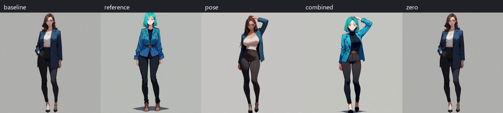
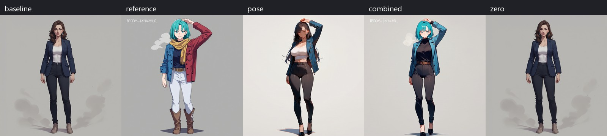
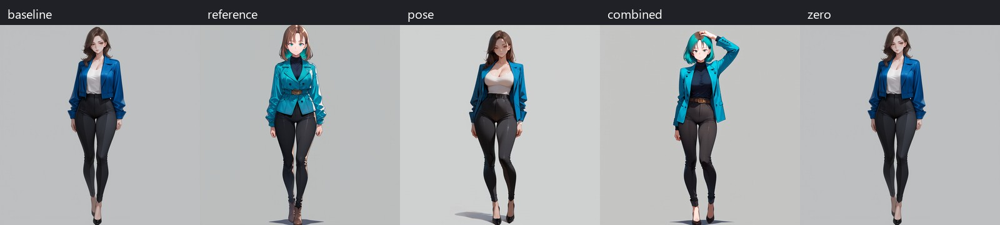
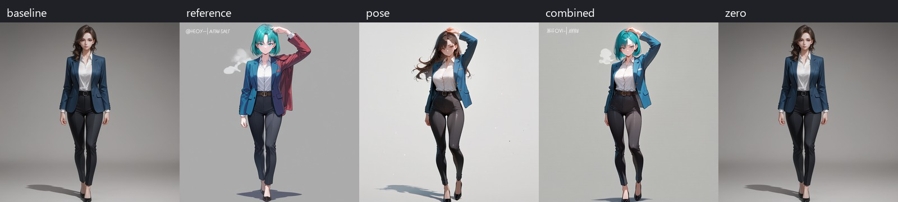
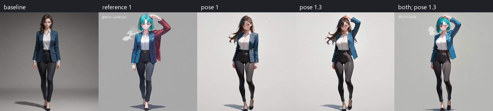

# Validation

Tested on Windows with an RTX 4070 Laptop GPU (8 GB), PyTorch 2.11.0+cu130,
SwarmUI 0.9.8.3 (`529b3b3`), and ComfyUI 0.35.0 (`a7b1d39d`). These were the
current upstream heads checked on September 10, 2026. The plugin and SwarmUI
compile with zero warnings and errors.

## Generation comparisons

The test uses the same prompt, seed 90210, 1024×1024 output, Euler/normal, and
unchanged preset settings within each row. For each profile it generates:
baseline, reference only, pose only, both, then both inputs with strengths zero.
Reference and pose strength are 1 when enabled. The zero case runs **after** the
other cases to catch patches leaking onto a shared model.

The settings were read from existing presets without editing them. Base
non-Turbo uses the same slow preset values with only the requested checkpoint
changed in the generation request.

| Profile | Steps | CFG | LoRAs |
|---|---:|---:|---|
| Anima base v1.0 | 30 | 4.5 | none |
| Anima base v1.0 + Turbo | 11 | 1 | Turbo v0.2: 0.8 |
| MiaoMiao Harem Anima 1.3 | 30 | 4.5 | none |
| MiaoMiao + Turbo and enhancement | 11 | 1 | Turbo v0.2: 0.8; Detail Tweaker: 0.8; Highres Aesthetic Boost: 0.7 |

Positive prompt before the preset's quality suffix:

```text
1girl, solo, adult woman, full body, front view, blue jacket, black trousers, brown hair, simple gray background
```

The preset appends `best quality, score_7, score_9,sensitive` and the listed LoRAs.
The negative prompt is `low quality, blurry, deformed, text, watermark` followed
by `worst quality, low quality, score_1, score_2, score_3, artist name`.

The [generated fixture](tests/results/reference-and-pose.png) has teal hair, a
red coat, and one arm raised above the head. This deliberately differs from the
prompt so that appearance and pose influence are visible independently.





Images are compact previews. [Pixel hashes and timings](tests/results/generation-checks.json)
record the original 1024px outputs. These are single-seed functional checks, not
a general benchmark of identity fidelity or pose accuracy.

All 20 generations completed. Each enabled path changed the image, and all four
zero-strength cases reproduced their baseline pixels exactly. Pose following
was strongest on base Anima. MiaoMiao's pose-only case missed the raised arm at
strength 1; combining the reference and pose recovered it. Enhancement LoRAs
could override pose and composition despite the control remaining active.
An additional MiaoMiao slow test at pose strength 1.3 recovered the raised arm
without a reference image.



A further five-case test used MiaoMiao's regular Turbo preset (11 steps, CFG 1,
Turbo 0.8) and a more explicit prompt: `1girl, solo, adult woman, full body, front
view, standing, wearing a blue blazer over a buttoned white shirt, black suit
trousers, brown hair, gray background`. Pose-only and combined controls both
recovered the raised arm. Its zero case differed by only 0.096/255 mean RGB,
consistent with the small low-VRAM variation described below. Saved presets
were unchanged throughout. See [zero comparisons](tests/results/zero-checks.json).



## Workflow and cache checks

- With two prompt images, the selected first or second image is exactly the one
  passed to the encoder. Only one reference adapter is added.
- Out-of-range image selection and reversed Start/End produce clear errors.
- With the attention window set to 0.99999–1 (after the sampled steps), two
  different reference images generate exactly the same pixels. At full range,
  reference strength 0.5 and 1 produce different results.
- Zero strengths omit encoder, detector, and adapter nodes entirely.
- A non-Anima model receives no Anima nodes.
- Adding both controls preserves preset prompt text, sampler, scheduler, step
  count, CFG, and LoRA values, including the enhancement preset.
- Six cache tests cover restart hits, LRU order, disabled caching, oversized
  entries, corrupt/stale recovery, and key invalidation.
- Actual SigLIP2 features and pose skeletons are bit-identical on disk-cache
  misses and hits. The hit tests replace the encoder/detector constructors with
  failing stubs, confirming that neither model is loaded again.

A separate cold/warm **generation** comparison across a full low-VRAM model
reload was visually equivalent but not pixel-identical: mean absolute RGB
difference was 0.464 on a 0–255 scale. The graph was identical, both caches hit,
and the cached tensors were exact. GPU weight placement differed across the
reload. Pixel-exact claims here apply to the same-environment disable checks,
not arbitrary model reloads or different hardware.

The pose implementation includes a correction found during actual generation
testing: raw VAE latents must pass through Anima's latent normalization before
the control embedder. A fixed-seed A/B recovered the raised arm after this change;
doubling raw control strength instead produced artifacts. The renderer also
matches the training code's hand/face draw order.

## Installed-instance check

After isolated validation, the same five-case smoke test passed on the installed
SwarmUI instance, using its existing MiaoMiao Turbo preset through the native
`presets` API parameter. The backend retained dynamic VRAM, pinned memory, and
Swarm's `--fast fp16_accumulation cublas_ops` flags. No low-VRAM workaround was
needed. Swarm selected its validated Comfy frontend 1.51.9 and updated PyAV to
18.1.0; PyTorch remained 2.11.0+cu130. Dependency checks passed.

All five cases completed in 10–25 seconds each, including first-use preprocessing.
Zero strength reproduced the baseline pixels exactly after both adapters had run.
The pose-only and combined cases at strength 1 changed pixels but missed the arm
under these precision settings. Two additional tests at pose strength 1.3 recovered
it, with and without reference guidance. This illustrates why guidance quality
must be inspected separately from a successful execution or a pixel difference.



[Live hashes and timings](tests/results/live-checks.json) include the five-case
test and the two stronger-pose cases. A Krea 2 NVFP4 generation also succeeded
with a Pose Image supplied: its graph contained no Anima nodes. All installed
Swarm extensions were rebuilt against the updated core and loaded successfully;
Timeline required the upstream `VideoEndFrame` → `VideoEndImage` rename. Fourteen
snapshotted preset parameter maps were compared after deployment and were unchanged.

## Automatic installation

The extension now uses ComfyUI's native prestartup hook for both Swarm's bundled
ExtraNodes path and a direct installation of this repository into ComfyUI's
custom_nodes folder. No generation code or saved presets were changed.

- An isolated Python environment started without `rtmlib`, and the model directory
  was empty. The startup hook installed it and downloaded/verified all seven real
  assets (2,411,734,784 bytes) in 104 seconds on the test connection.
- The next setup run took 1.6 seconds with network and pip calls replaced by failing
  stubs. Every asset was reused and checked locally.
- A plain external environment without OpenCV or ONNX Runtime installed those
  automatically while retaining its existing package versions. The resulting
  detector successfully returned one 133-keypoint pose from the test fixture.
- A real isolated ComfyUI startup discovered the repository's startup hook and
  registered all four Anima nodes. Asset lookup also passed with a different
  preconfigured IP-Adapter search directory.
- Eight installer tests cover verified downloads, offline reuse, preserved file
  conflicts, corrupt/network-failed downloads, retries, concurrent startup,
  dependency isolation, and preservation of newer installed dependencies.
  Together with the six cache tests, all 14 tests pass.

The small [setup report](tests/results/automatic-setup-checks.json) records the
fresh-download and offline-repeat timings. Required downloads happen once, during
backend startup; internet access is unnecessary for subsequent extension use.

After deployment, the real Swarm-managed backend ran the new hook in 1.5 seconds.
Its package snapshot and all 51 saved preset maps were unchanged. The five-case
MiaoMiao Turbo smoke test passed again: every image matched its corresponding
pre-setup-update pixel hash, and zero strength was identical to baseline.
The installed environment's dependency check also passed.

## Reproduce

Run the cache tests in your ComfyUI Python environment:

```sh
python -m unittest discover -s tests -v
```

With the model assets installed, verify exact cold/hit preprocessing tensors on CPU:

```sh
python tests/check_preprocessing.py --comfyui /path/to/ComfyUI
```

The smoke test generates five images on backend 0 through Swarm's ordinary API.
It applies an existing preset without modifying it, verifies that each enabled
path changes pixels, and compares zero strength with the baseline. By default,
it allows a mean difference of 1/255 for low-VRAM numerical variation; pass
`--zero-tolerance 0` to require bit-identical output. Zero must also omit every
Anima adapter and preprocessing node from the generated workflow.
Inspect the saved images for guidance quality as well.

```sh
python tests/smoke_swarm.py --url http://127.0.0.1:7801 --preset "Your Anima preset"
```

Alternatively pass `--model` with a name from `ListT2IParams` for the default
30-step, CFG 4.5 case. Use `--backend`, `--reference`, `--pose`, and `--output`
to select a test backend and fixtures. Results default to ignored `tests/output/`.
Fixed seeds are compared within the same environment; hardware, precision,
samplers, and dependency changes can alter hashes across machines.
